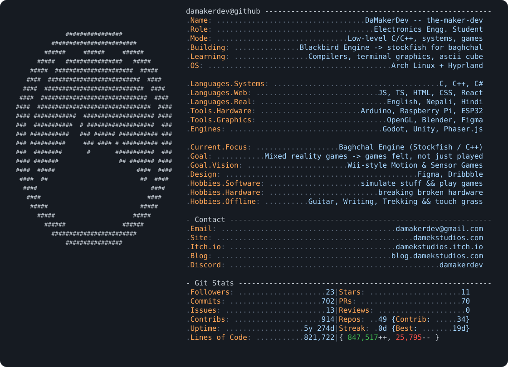

<picture>
  <source media="(prefers-color-scheme: dark)" srcset="./profile-dark.svg">
  <source media="(prefers-color-scheme: light)" srcset="./profile-light.svg">
  
</picture>

<div align="center">


</div>

```
┌─[damaker@dev]─[~]
└──╼ $ ps aux | grep projects
```

<pre>
PID   PROJECT                    STAT      %FUN   COMMAND
001   <a href="https://damekstudios.com/adkalbaji">adkalbaji</a>                  live      98%    heads-up party game · Nepali + English · Play Store
002   <a href="https://github.com/damakerdev/baghchal">blackbird-engine</a>           building   ∞     stockfish for baghchal using c++ · learning A LOT
003   <a href="https://damakerdev.github.io/3d-globe-proj/">3d-globe-proj</a>              running   80%    visualizing locations on a 3D globe with JS
004   <a href="https://damekstudios.itch.io/jhandi-burja/">jhandi-burja</a>               live      75%    web recreation of the classic dice game
005   <a href="https://damekstudios.itch.io/retpoc/">retpoc</a>                     live      70%    flappy copter, basically
006   <a href="https://play.damekstudios.com/budget-like-a-minister/">budget-like-a-minister</a>     live      85%    allocate Nepal's Rs.2T budget wisely... or not
007   <a href="https://damakerdev.github.io/tictactoe/">tic tac toe</a>                live      67%    unbeatable tic tac toe. win if u can :)
008   <a href="https://damekstudios.itch.io/end2start">end2start</a>                  live      65%    word chain game, last letter starts the next word
009   <a href="https://damakerdev.github.io/shoot-em-up/">shoot-em-up</a>                live      60%    JS bookmarklet, turns any site into a shooter
010   <a href="https://github.com/damakerdev/dotfiles">dotfiles</a>                   stable    -69%   arch + hyprland config
</pre>

```
┌─[damaker@dev]─[~]
└──╼ $ ./reach_me.sh
```

<div align="center">

[](mailto:damakerdev@gmail.com)
[](https://damekstudios.com)
[](https://damekstudios.itch.io)
[](https://play.damekstudios.com)
[](https://blog.damekstudios.com)

[](https://dribbble.com/anujsapkota)


</div>

```
┌─[damaker@dev]─[~]
└──╼ $ fortune -s

eat. sleep. build. repeat.
build slow. build low-level. build relationships. build things that last. build things that help. 
build stuff, share stuff. help people, love people.
touch grass occasionally.
happy living, happy coding.

jaOS ;)
$ █
```
